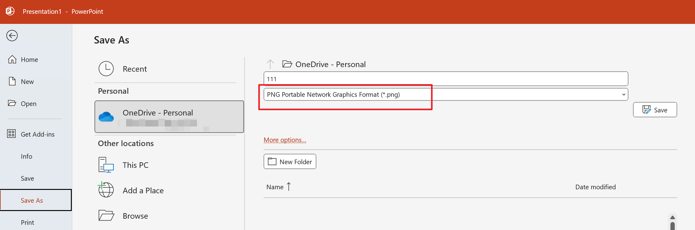

# ppt2png

## Install Guide 安装指南

```shell
pip install -r requirements.txt
```

## Quick Start 如何使用

### 修改 Office 输出 DPI 设置

[How to export high-resolution (high-dpi) slides from PowerPoint - Microsoft 365 Apps | Microsoft Learn](https://learn.microsoft.com/office/troubleshoot/powerpoint/change-export-slide-resolution)

### 在 PPT 内导出为图片



### 在Python内指定图片文件夹和输出文件地址

```python
# main.py
img_path = r"D:\Path\To\Image\Folder"
output_path = r"D:\Path\To\Release.pptx"
```

### 运行Python脚本

```shell
python main.py
```

完成！
